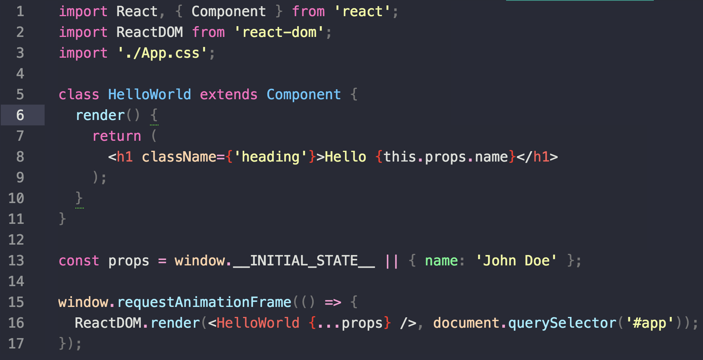
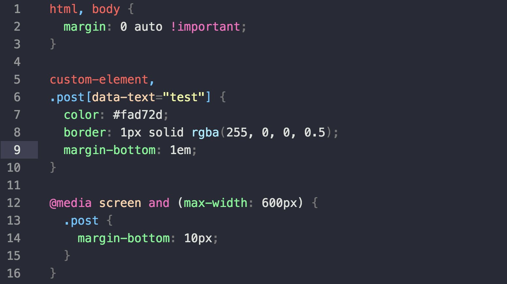

# Atom Snazzy Clear Syntax

Simple, distraction-free atom syntax based on awesome [hyper-snazzy](https://github.com/sindresorhus/hyper-snazzy)

## Screenshot

- JavaScript

- CSS

## Acknowledgement

Thanks to [Sindre Sorhus](https://github.com/sindresorhus) for his awesome color palette in `hyper-snazzy`.

## License

MIT
